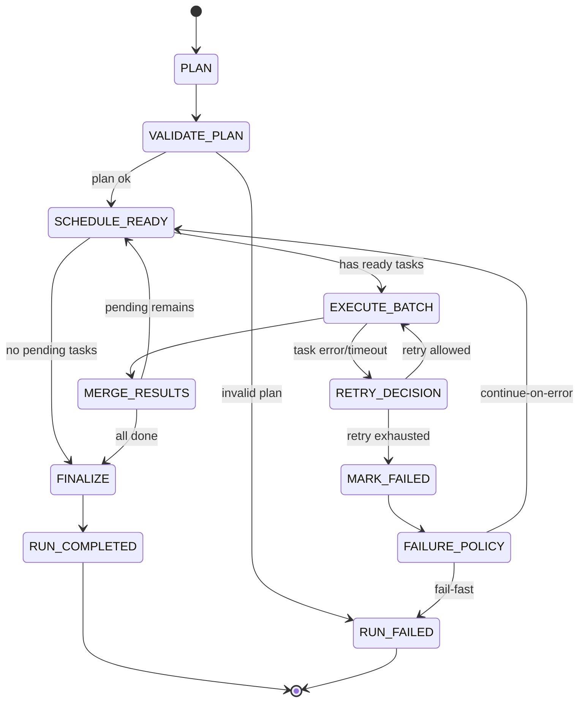

# Worker 间对话最小协议（v1）

## TaskEnvelope

```json
{
  "version": "v1",
  "traceId": "trc_20260504_001",
  "runId": "run_group_123",
  "groupId": "group-123",
  "task": {
    "taskId": "t2",
    "type": "worker_message",
    "fromWorkerId": "researcher",
    "toWorkerId": "writer",
    "intent": "根据前置分析输出可发布内容",
    "message": "请基于前置结果生成 3 条推文草案",
    "dependsOn": ["t1"],
    "artifactsIn": [
      {
        "artifactId": "a_t1_report",
        "kind": "text",
        "mimeType": "text/plain",
        "uri": "artifact://run_group_123/a_t1_report",
        "checksum": "sha256:xxxx"
      }
    ],
    "constraints": {
      "timeoutMs": 120000,
      "maxRetries": 2,
      "retryBackoffMs": 1500,
      "requireAbsolutePath": true
    },
    "idempotencyKey": "run_group_123_t2_v1"
  }
}
```

## TaskResult

```json
{
  "version": "v1",
  "traceId": "trc_20260504_001",
  "runId": "run_group_123",
  "groupId": "group-123",
  "taskId": "t2",
  "workerId": "writer",
  "status": "completed",
  "startedAt": "2026-05-04T09:10:00.000Z",
  "completedAt": "2026-05-04T09:10:08.500Z",
  "durationMs": 8500,
  "output": {
    "text": "推文草案1...\n推文草案2...\n推文草案3..."
  },
  "artifactsOut": [
    {
      "artifactId": "a_t2_tweets",
      "kind": "json",
      "mimeType": "application/json",
      "uri": "artifact://run_group_123/a_t2_tweets",
      "checksum": "sha256:yyyy"
    }
  ],
  "usage": {
    "promptTokens": 1200,
    "completionTokens": 260,
    "totalTokens": 1460
  },
  "error": null
}
```

## Event（SSE）

```json
{
  "event": "task.chunk",
  "timestamp": "2026-05-04T09:10:03.120Z",
  "traceId": "trc_20260504_001",
  "runId": "run_group_123",
  "groupId": "group-123",
  "taskId": "t2",
  "workerId": "writer",
  "seq": 7,
  "payload": {
    "chunk": "推文草案1：..."
  }
}
```

## LangGraph 状态图草图


